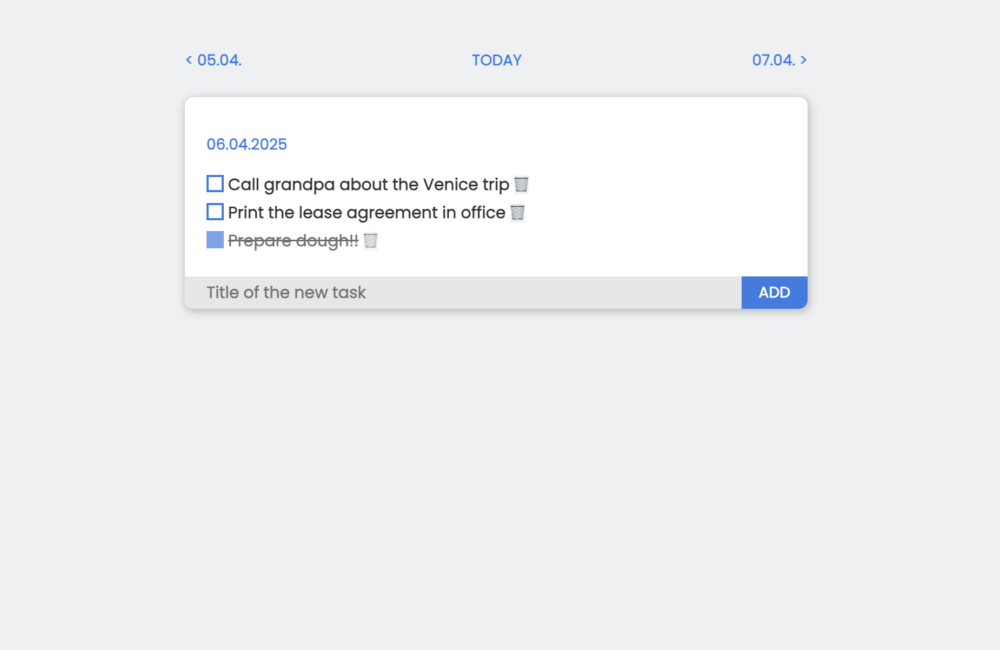
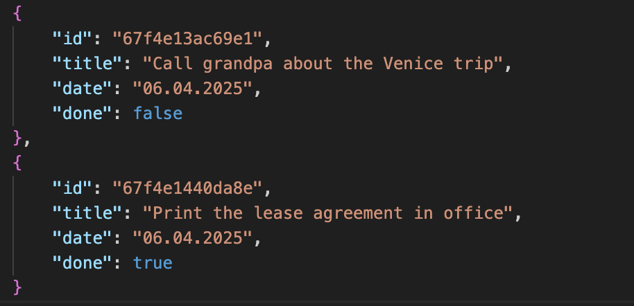

### Minimalistic todo app with single JSON for tasks and <100 lines of PHP

This is my take on feature-complete todo app.
It has just the essentials to get the ball rolling, and absolutely nothing else. I've started from a robust PWA, and cut pieces out until I was happy with its simplicity and not frustrated by its unusability at the same time.

### Features
- lists tasks by their date
- you can navigate by date back and forth with the ever-present Today button
- task added at any day will be assigned to that day
- you can delete tasks using a bin icon at the end (with browser confirmation)
- there is a password on the 3rd line of index.php for you to change
- no dependencies, only writing access for the json

PHP and CSS are both below 100 LOC.

### Screenshot

(the only screen after login)

(preview of the tasks json)

### Install
Simply copy the repository (although index.php and neon.css are enough) to your web server and access its path via the browser.
On the 3rd line of `index.php`, change the default password:
`$password = 'password';`. Auth is performed by PHP's SESSION.